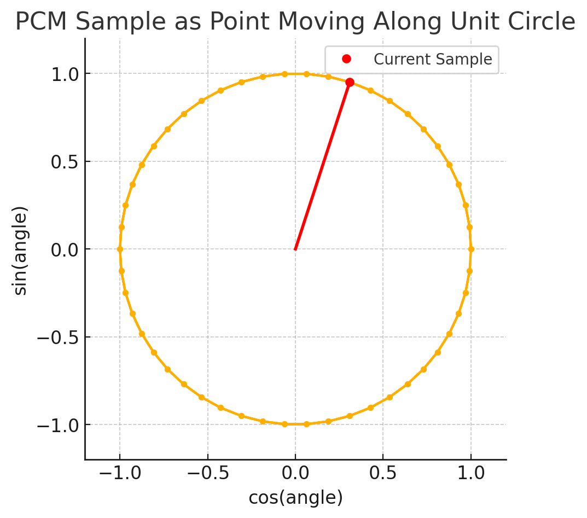
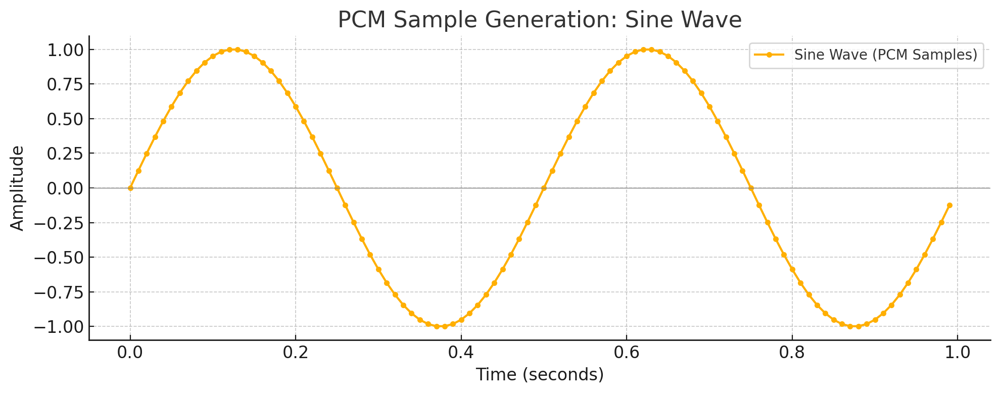

# Making a sound

At this step we'll make the computer go "beep". This is the first step in creating a tool to write and play music. The goal is to generate a sound wave that can be played back through the computer's speakers.

Sound can be thought of as a wave. It is a vibration that travels through the air (or any other medium) and can be heard when it reaches the ear. It can be represented as a sinusoid and described by its frequency and amplitude. The frequency is the number of cycles per second, and the amplitude is the height of the wave. The higher the frequency, the higher the pitch of the sound. The higher the amplitude, the louder the sound.

To describe and replay the sound with a computer, we can quantize the wave that produces it into a series of samples. Each sample is a number that represents the amplitude of the wave at a given point in time. The more samples we have, the more accurate the representation of the sound.

  
  

To quantize generate the samples we need to take into account the following:

    sample[n]= A ⋅ sin(2 * π * f * (n / R)​)

Where:

* **A** - Amplitude (max value based on bit depth, e.g., 32767 for 16-bit)
* **f** - Frequency (Hz), e.g., middle C = 261.63 Hz
* **R** - Sample rate (samples per second), typically 44100 Hz
* **n** - Sample number (integer), from 0 to R × duration − 1

Hopefully this was enough to get you started. The linked resources might also be helpful.

Now let's take a look at the code.

The `generatePCM` function is defined in . It takes the following parameters:

We have a failing test, once the `generatePCM` is implemented you should hear a second long beep.

Once this is done you can move on to the [step two].

[step two]: ./02-a-better-language-for-instructions.md

----

* [Tone generator](https://onlinesound.net/tone-generator)
* [Sinusoid](https://tenor.com/view/sinusoide-gif-26675443)
